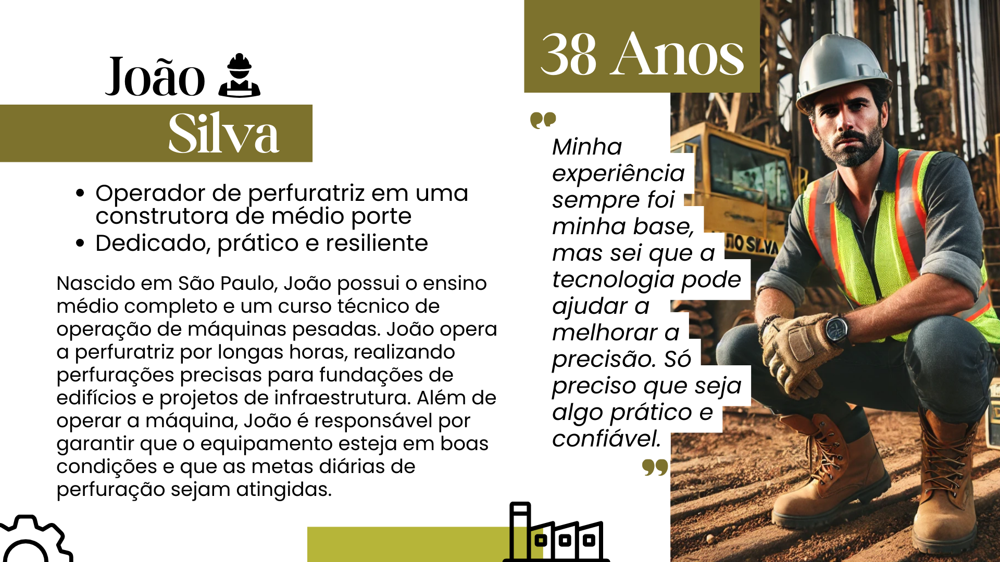
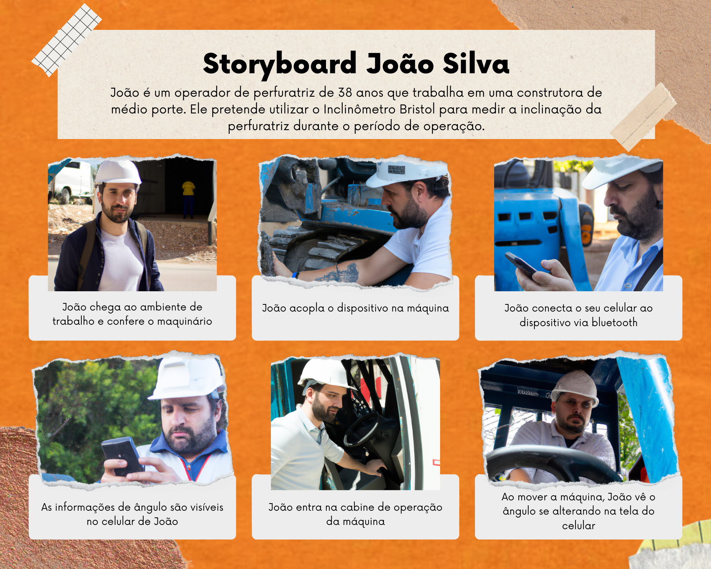

# Inclinômetro Bristol

## 1. Introdução à Bristol e ao problema

&emsp;"A Bristol é uma empresa genuinamente brasileira, que se destaca na fabricação de implementos agrícolas ligados ao ramo da motosserra e na fabricação de perfuratrizes e brocas, amplamente utilizados na construção civil. Sua linha de produtos é bastante extensa, suprindo as necessidades de uma enorme gama de consumidores no Brasil e exterior." 

&emsp;Dessa forma, a Bristol se coloca como uma empresa B2B que vende, para empresas do setor agrícola, construção civíl, etc, máquinas que dão suporte nessas determinadas áreas. Para este projeto, foi indicado um problema/necessidade: a falta de uma maneira simples e rápida para se medir a inclinação de uma máquina perfuratriz. Medir a inclinação de uma perfuratriz é algo útil por diversos motivos, incluindo:
* Precisão no Posicionamento: Em muitos projetos de perfuração, como na indústria de petróleo, gás ou mineração, é de extrema importância que a perfuração siga um ângulo exato para atingir um ponto ou camada específica do subsolo. Medir a inclinação ajuda a garantir que o furo esteja na direção correta.
* Segurança Operacional: Uma perfuração desalinhada pode resultar em falhas no equipamento, vazamentos ou até acidentes. Medir a inclinação permite monitorar a trajetória da perfuratriz e ajustar o ângulo conforme necessário para evitar problemas.
* Eficiência e Custo: A perfuração em ângulos inadequados pode levar a um maior consumo de recursos, como tempo e energia. Controlar a inclinação ajuda a otimizar o processo, tornando-o mais eficiente e econômico.
* Controle da Direção: Em algumas operações, como a perfuração direcional, é necessário controlar a trajetória para chegar a alvos específicos. Medir a inclinação é essencial para garantir que o furo siga o caminho desejado.

&emsp;Com todos esse becefícios expostos, fica claro que não possuir uma maneira simples, rápida e direta de medir essa inclinação logo pode se tornar uma dor e um ponto de gargalo para a produção. Assim, o presente projeto tem como objetivo solucionar este projeto, servindo como um analgésico para esta dor. 

## 2. Apresentação da solução

&emsp;De início, foi definido um escopo que conseguísse suprir todas as necessidades da Bristol. A solução deveria suprir a necessidade de medir a inclinação do maquinário enquanto opera em situações adversas, incluindo altos níveis de vibração, alta temperatura e presença de poeira e/ou água. A partir desses requisitos, a solução pensada envolve um dispositivo IOT (Internet das Coisas) que será acoplado em uma perfuratriz. O dispositivo deverá utilizar sensores para medir a inclinação da perfuratriz em relação ao solo e enviar esse dado via BLuetooth para o celular do operador, que deve poder se conectar ao dispositivo com o seu celular e visualizar os dados de maneira simples. Além disso, todo o case/carenagem do dispositivo deve ser desenvolvido tendo em mente as condições de alta presença de poeira, temperaturas altas (50°C) e autonomia de bateria de pelo menos 24 horas. Mais detalhes sobre os requisitos funcionais e não-funcionais podem ser encontrados na seção X.X.

### 2.1. Divisão de fases do projeto

&emsp;A principio, foi acordo com a Bristol que o projeto seria desenvolvido ao longo de 5 meses a fim de se entregar uma versão completa e pronto para uso. Além disso, foram definidos entregáveis para cada mês de execução do projeto, levando em consideração que o primeiro mês é voltado para compra e teste de componentes, bem como desenvolvimento preliminar de uma placa inicial para validação da ideia. As entregas são como seguem:

**Entregáveis**:
- Protótipo funcional em protoboard com ESP32 e MPU9250.
- Firmware básico para:
  1. Leitura dos dados do inclinômetro (ângulos em X e Y).
  2. Cálculo do ângulo de inclinação em relação ao solo.
  3. Transmissão dos dados via Bluetooth para um aplicativo simples (ex.: interface básica ou software como Serial Bluetooth Terminal).
- Projeto e fabricação de uma PCI inicial simples para substituir a protoboard, com:
     - Conexões para ESP32, acelerômetro e bateria.
- Teste do dispositivo em campo para verificar funcionamento básico.
- Documentação inicial sobre os componentes usados e instruções para testes.
- Case protótipo: Desenvolvimento inicial de um protótipo de case simples, a ser desenvolvido em máquina corte a laser ou impressora 3D (ainda não resistente a água/poeira).

#### 2º Mês - Protótipo Aprimorado
**Objetivo**: Aprimorar o protótipo básico, implementar funcionalidades extras e preparar o dispositivo para um ambiente mais robusto.

**Entregáveis**:
- Firmware aprimorado com:
  1. Indicação do nível da bateria.
  2. Armazenamento interno dos dados de inclinação (em caso de perda de conexão Bluetooth).
  3. Otimização do cálculo de inclinação.
- Melhorias na PCI: Projeto de uma segunda versão com:
  1. Layout otimizado para resistência a vibração.
  2. Melhor proteção contra ruídos e falhas.
  3. Inclusão de LED para status de ligação e conexão Bluetooth.
- Implementação de uma interface web simples para exibir dados de inclinação e nível da bateria (em desenvolvimento inicial).

#### 3º Mês - Protótipo Avançado
**Objetivo**: Desenvolver um protótipo mais próximo da versão final, com foco em funcionalidades de software e conectividade.

**Entregáveis**:
- Firmware avançado com:
  1. Atualização de firmware via web (OTA).
  2. Melhorias na estabilidade da conexão Bluetooth.
  3. Modos de operação otimizados para economia de energia.
- Interface web funcional:
  1. Dashboard simples para exibir inclinação em tempo real, histórico e nível da bateria. Incluindo uma versão a ser utilizada como app mobile.

#### 4º Mês - Versão Pré-Final
**Objetivo**: Refinar o hardware e software, incluindo integração de todas as funcionalidades. Aprimorar case.

**Entregáveis**:
- Placa de circuito avançada: Projeto finalizado para uma versão industrial robusta, incluindo a utilização de CI's ao invés de módulos pré-prontos.
- Testes de resistência à vibração e temperatura.
- Firmware quase final:
  1. Últimas correções e ajustes de funcionalidades.
  2. Sincronização confiável com a interface web.
  3. Interface web refinada: Melhorias visuais e de usabilidade.
  4. Gráficos de histórico.
  5. Indicadores de status do dispositivo (ex.: conectado/desconectado).

#### 5º Mês - Versão Final e Entrega
**Objetivo**: Finalizar o dispositivo e preparar para implantação.

**Entregáveis**:
- Protótipo finalizado:
  1. Placa de circuito impressa final (projeto industrial).
  2. Case resistente a água, poeira e vibração.
  3. Firmware completamente funcional e atualizado.
  4. Interface web completa:
     1. Visualização em tempo real e histórico de dados.
     2. Funcionalidade para atualização remota do firmware.
  5. Documentação técnica completa:
     1. Esquemas do hardware.
     2. Código-fonte comentado.
     3. Guia de uso e manutenção.
     4. Testes finais de validação do produto.
  6. Apresentação do protótipo final ao cliente.

## 3. Persona 

&emsp;Personas são descrições fictícias, porém precisas, de possíveis usuários da solução a ser desenvolvida. A análise e criação de personas é um passo fundamental no desenvolvimento de um projeto, independente de seu escopo. A mesma tem a função de guiar o processo de criação, tendo sempre um foco primordial na pessoa que utilizará e manipulará sua solução (Marúas, 1997). Se bem feita, torna o nível de acurácia e satisfação do produto final maior, mais abrangente e satisfatório.

Figura 1 - Persona João Silva parte 1 

   

Fonte: Material produzido pelos autores (2025)

&emsp;João Silva é a principal persona deste projeto. Ele representa justamente o principal usuário do dispositivo: o operador de máquinas pesadas como a perfuratriz. João é um operador natual de São Paulo, com um ensino técnico em operação de maquinário pesado. No seu dia-a-dia, ele opera a perfuratriz por longas horas, realizando perfurações precisas para fundações de edifícios e projetos de infraestrutura. Além de operar a máquina, João é responsável por garantir que o equipamento esteja em boas condições e que as metas diárias de perfuração sejam atingidas.

Figura 2 - Persona João Silva parte 2 

   

Fonte: Material produzido pelos autores (2025)

&emsp;João, infelizmente, é Corinthiano... Entretanto, isso não o impede de valorizar extremamente a segurança em seu trabalho. Entretanto, ele sempre gosta de deixar clara a sua intenção de manter a eficiência mesmo com constantes verificações de segurança. Em relação ao uso de tecnologias para facilitar a sua vida, João prefere soluções diretas, que não precisem de muitas etapas para serem utilizadas. Em seu trabalho, a sua maior dor é a falta de um sistema de monitoramento de inclinação deixa a máquina sujeita a erros ou desgastes desnecessários. Sua maior necessidade envolve, dessa forma, um equipamento capaz de medir a inclinação da perfuratriz e que suporte as condições adversas da obra, como poeira, vibrações e altas temperaturas.

&emsp;A criação de João como persona para o projeto é essencial para que seja possível entender as necessidades, desafios e motivações de um público específico que o projeto pretende atingir. Ele possui as características de um trabalhador que é acostumado a operar máquinas pesadas e permite que a solução seja desenvolvida de maneira estratégica para sanar as suas dores. Assim, não é exagero algum dizer que João molda completamente o projeto, definindo muito de como o trabalho será feito.  

## 3.1. Storyboard da persona 
&emsp;De acordo com Gorny (2021), o storyboard é uma ferramenta essencial para antecipar e estruturar narrativas visuais, permitindo que designers identifiquem problemas de usabilidade e fluxo por meio de uma sequência de imagens que representam a interação do usuário. Dessa maneira, no contexto do nosso projeto, o storyboard é utilizado para ilustrar como o produto será utilizado no cotidiano dos usuários, servindo como um guia visual prático. A vantagem de usar imagens é que elas tornam a história fácil de entender à primeira vista e facilitam a memorização.

Em geral, a criação de um storyboard inclui três elementos principais: o cenário, o visual e a legenda.

* Cenário: Os storyboards são baseados em um cenário ou em uma história de usuário, e esse cenário é claramente especificado no topo do storyboard.
* Visual: São as representações gráficas ou ilustrações da interação de cada etapa do cenário.
* Legenda: Cada visual tem uma legenda correspondente. A legenda descreve brevemente as ações do usuário, ambiente, estado emocional, dispositivo e assim por diante.

&emsp;Dessa forma, para o projeto do Inclinômetro Bristol, o storyboard representa uma ótima ferramenta para que se possa entender e ter uma ideia ilustrada de como a pesona utilizaria o dispositivo no dia-a-dia. No caso da persona João Silva, o storyboard é pensando justamente no seu dia de trabalho e consiste em 6 fases principais, sendo elas:

* João chega ao ambiente de trabalho e confere o maquinário
* João acopla o dispositivo na máquina
* João conecta o seu celular ao dispositivo via bluetooth
* As informações de ângulo são visíveis no celular de João
* João entra na cabine de operação da máquina
* Ao mover a máquina, João vê o ângulo se alterando na tela do celular

&emsp;Essas fases representam de maneira genuína e simplificada o fluxo de trabalho de João em uma obra de construção civil que utiliza o Inclinômetro Bristol para medir a inclinação de uma perfuratriz. Tais fases também podem ser vistas de maneira visual abaixo (note que as imagens foram geradas por inteligência artificial, o que pode acarretar em erros e inconsistências):

Figura 3 - Storyboard João Silva 

   

Fonte: Material produzido pelos autores (2025)

&emsp;A análise do storyboard de João revela insights essenciais sobre as necessidades específicas de sua persona na interação com o dispositivo, destacando a necessidade por melhorar as qualidade de segurança de trabalho enquanto ainda oferece uma solução simples e eficiente. Ao final do desenvolvimento do storyboard, fica claro como cada etapa de interação foi projetada para responder às necessidades e expectativas da persona desse projeto. Ao entender e antecipar as motivações dos usuários, o projeto proporciona uma melhor experiência, que fortalece o engajamento e a confiança no dispositivo e os dados coletados.

## 4. Requisitos funcionais e não-funcionais
&emsp;Requisitos funcionais e não funcionais são componentes essenciais no desenvolvimento de sistemas, pois definem tanto as funcionalidades esperadas quanto os padrões de desempenho, segurança e usabilidade necessários para que o sistema atenda plenamente às expectativas dos usuários e às demandas estratégicas do negócio. Estes requisitos formam a base para a arquitetura, direcionam as implementações técnicas e garantem a eficácia do sistema ao longo de seu ciclo de vida.

### 4.1. Requisitos Funcionais
&emsp;Em um projeto de tecnologia, os requisitos funcionais descrevem todas as funcionalidades e serviços que uma solução deve possuir a fim de atender as necessidades do usuário. Dessa forma, os requisitos funcionais devem deixar explícitos o que o produto/sistema deve fazer de maneira que esteja alinhado às regras de negócio.

| RF#  | Descrição                                                                                                   |
|------|-------------------------------------------------------------------------------------------------------------|
| RF01 | O dispositivo deve ser capaz de medir o seu ângulo de inclinação em pelo menos dois eixos (X, Y)            |
| RF02 | O dispositivo deve enviar os dados de inclinação via Bluetooth                                              |
| RF03 | O dispositivo deve ser alimentado por bateria recarregável em automóveis                                    |
| RF04 | O dispositivo deve armazenar os dados de medição localmente em um cartão SD                                 |
| RF05 | O dispositivo deve possuir botões para ligar e desligar                                                     |
| RF06 | O dispositivo deve possuir leds para indicar atividade e conexão Bluetooth                                  |
| RF07 | O dispositivo deve permitir atualizações de software de maneira remota                                      |
| RF08 | A interface gráfica deve mostrar informações de ângulo e bateria do dispositivo                             |

Quadro 1: Requisitos Funcionais -  Material criado e desenvolvido pelo desenvolvedor. 

### 4.2. Requisitos não-funcionais
&emsp;Os requisitos não funcionais dizem respeito à qualidade e ao desempenho do sistema. Esses requisitos abordam atributos como usabilidade, segurança, confiabilidade, escalabilidade e eficiência. Por exemplo, um requisito não funcional pode especificar que o cadastro em um sistema deve ser rápido, em um tempo estimado de menos de cinco segundos, e que os dados pessoais dos usuários devem ser criptografados para garantir segurança. Da mesma forma, requisitos como alta disponibilidade, como se, o sistema deve estar disponível 100% (cem por cento) do tempo e escalabilidade para suportar até mil acessos simultâneos são exemplos destas características não funcionais.  
&emsp;Neste contexto supramencionado, a principal diferença entre requisitos funcionais e não funcionais é que os requisitos funcionais focam nas tarefas e operações que o sistema deve realizar, enquanto os requisitos não funcionais lidam com a qualidade e as restrições sob as quais essas operações devem ocorrer.

**Utilização de normas ISO:**

&emsp;A sigla ISO significa International Organization for Standardization. Tal organização é responsável por padronizar produtos e serviços ao redor do mundo. As normas definidas por essa organização se mostram de extrema importância uma vez que, num mundo cada vez mais globalizado e com cada país seguindo seus próprios critérios, uma padronização desses critérios auxilia o comércio internacional, promove a concorrência justa e melhora a eficiência a nível global. 
&emsp;A ISO25010 é uma norma internacional que define critérios de qualidade para o desenvolvimento de software (Ariele, 2015). Dessa forma, é comum que organizações utilizem tal norma para avaliar a qualidade de seus produtos e verificar quais pontos podem ou devem ser melhorados. 
&emsp;Um dos pontos que é abordado na ISO25010 é o Modelo de Qualidade de Produto, que define os critérios para avaliar, especificamente, código e demais recursos presentes no software (Britton, 2021). Alguns dos aspectos de qualidade avaliados neste modelo incluem a confiabilidade do produto, seus requisitos de segurança e a eficiência de uso de recursos (como memória e processamento).

| **RNF#**   | **Descrição**                                                                                                            | **Aspecto de Qualidade**      |
|-----------|------------------------------------------------------------------------------------------------------------------------|-------------------------------|
| RNF01     | O dispositivo deve utilizar os três sensores (Acelerômetro, Giroscópio e Magnetômetro) para minimizar erros de medição.  | Precisão                     |
| RNF02     | A autonomia da bateria deve ser de pelo menos 1 dia em operação contínua.                                               | Eficiência Energética         |
| RNF03     | A precisão mínima das medições de ângulo deve ser de 1°.                                                                | Precisão                     |
| RNF04     | Deve ser implementado um filtro de Kalman para melhorar a fusão de dados e reduzir ruídos nas medições.                 | Funcionalidade e Precisão     |
| RNF05     | O sistema deve ser resistente a vibrações intensas e a temperaturas de até 50 °C.                                       | Confiabilidade               |
| RNF06     | O dispositivo deve ter proteção contra água e poeira (equivalente a uma classificação IP65 ou superior).                | Manutenibilidade             |
| RNF07     | O dispositivo deve ser capaz de transmitir dados via Bluetooth em tempo real com um alcance mínimo de 10 metros.       | Desempenho                   |
| RNF08     | O design do hardware deve garantir segurança elétrica e conformidade com normas de certificação, como a CE.             | Segurança e Conformidade     |
| RNF09     | O dispositivo deve ter um tempo de resposta máximo de 200 ms para a transmissão de dados.                              | Desempenho                   |
| RNF10     | O aplicativo deve ser intuitivo e de fácil uso, permitindo conexão rápida ao dispositivo.                              | Usabilidade                  |

Quadro 2: Requisitos Não-Funcionais -  Material criado e desenvolvido pelo desenvolvedor. 

&emsp;Cada um desses requisitos não funcionais pode ser testado individualmente, a fim de garantir a funcionalidade correta do dispositivo.

| **RNF**   | **Método de Teste**                                                                                                                |
|-----------|-----------------------------------------------------------------------------------------------------------------------------------|
| **RNF01** | Realizar testes comparativos entre leituras individuais do acelerômetro, giroscópio e magnetômetro e a fusão dos três sensores. Validar a redução de erros na medição combinada. |
| **RNF02** | Colocar o dispositivo em operação contínua em condições típicas de uso (sensores ativos, transmissão Bluetooth) e medir o tempo de autonomia da bateria até o esgotamento. |
| **RNF03** | Calibrar o sistema com um dispositivo de referência (como um inclinômetro industrial, ou, em casos mais simples, até mesmo um transferidor) e validar se os valores medidos têm uma variação máxima de ±1°. |
| **RNF04** | Implementar o filtro de Kalman e comparar as leituras do sistema com e sem o filtro em ambientes com ruído (como vibrações). Verificar a estabilidade e precisão dos valores. |
| **RNF05** | Submeter o dispositivo a condições de vibração (com uma máquina de vibração ou superfície de teste) e temperaturas de até 50 °C, monitorando a consistência das medições. |
| **RNF06** | Realizar testes de imersão leve e exposição a poeira, simulando condições equivalentes a IP65. Verificar o funcionamento normal do dispositivo após os testes. |
| **RNF07** | Testar a transmissão de dados via Bluetooth em diferentes distâncias (até 10 metros) e ambientes variados (com obstáculos e interferências). Validar a recepção estável dos dados. |
| **RNF08** | Verificar se os circuitos eletrônicos atendem a padrões de certificação CE, como isolamento, proteção contra curto-circuito e testes de segurança elétrica. |
| **RNF09** | Monitorar o tempo de transmissão dos dados (desde a captura pelo sensor até a exibição no aplicativo) usando ferramentas de medição de latência. Confirmar que não excede 200 ms. |
| **RNF10** | Realizar testes de usabilidade com operadores reais, verificando o tempo necessário para conectar o dispositivo e começar a receber dados. Observar possíveis dificuldades na interface. |

Quadro 3: Testes dos Requisitos Não-Funcionais -  Material criado e desenvolvido pelo desenvolvedor. 

## X. Referências
MARÍAS, Julián. Persona. Alianza, 1997. Disponível em: http://www.hottopos.com/mp2/mariaspers.htm. Acesso em: 22 jan. 2025.

GORNY, L. The story of storyboarding: exploring the hidden art form behind films. Disponível em: <https://www.itsnicethat.com/features/the-story-of-storyboarding-animation-film-061021>. Acesso em 23 jan. 2025

ARIELE. O que é ISO? Blog da Qualidade. Disponível em: https://blogdaqualidade.com.br/o-que-e-iso/. Acesso em: 25 jan. 2025.

BRITTON, J. What Is ISO 25010? Disponível em: <https://www.perforce.com/blog/qac/what-is-iso-25010>. Acesso em: 25 jan. 2025.

‌

