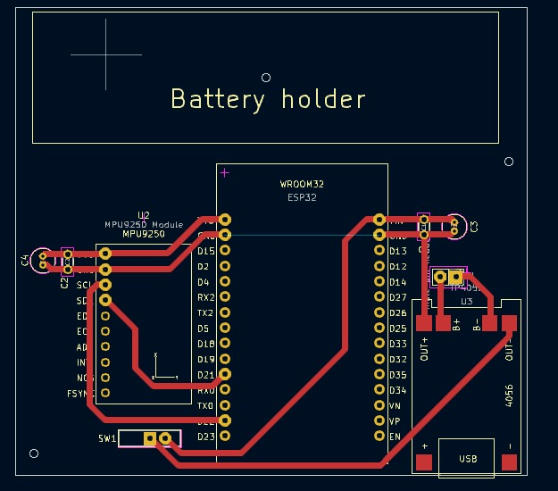

# Inclinômetro Bristol

## 1. Introdução à Bristol e ao problema

&emsp;"A Bristol é uma empresa genuinamente brasileira, que se destaca na fabricação de implementos agrícolas ligados ao ramo da motosserra e na fabricação de perfuratrizes e brocas, amplamente utilizados na construção civil. Sua linha de produtos é bastante extensa, suprindo as necessidades de uma enorme gama de consumidores no Brasil e exterior." 

&emsp;Dessa forma, a Bristol se coloca como uma empresa B2B que vende, para empresas do setor agrícola, construção civíl, etc, máquinas que dão suporte nessas determinadas áreas. Para este projeto, foi indicado um problema/necessidade: a falta de uma maneira simples e rápida para se medir a inclinação de uma máquina perfuratriz. Medir a inclinação de uma perfuratriz é algo útil por diversos motivos, incluindo:
* Precisão no Posicionamento: Em muitos projetos de perfuração, como na indústria de petróleo, gás ou mineração, é de extrema importância que a perfuração siga um ângulo exato para atingir um ponto ou camada específica do subsolo. Medir a inclinação ajuda a garantir que o furo esteja na direção correta.
* Segurança Operacional: Uma perfuração desalinhada pode resultar em falhas no equipamento, vazamentos ou até acidentes. Medir a inclinação permite monitorar a trajetória da perfuratriz e ajustar o ângulo conforme necessário para evitar problemas.
* Eficiência e Custo: A perfuração em ângulos inadequados pode levar a um maior consumo de recursos, como tempo e energia. Controlar a inclinação ajuda a otimizar o processo, tornando-o mais eficiente e econômico.
* Controle da Direção: Em algumas operações, como a perfuração direcional, é necessário controlar a trajetória para chegar a alvos específicos. Medir a inclinação é essencial para garantir que o furo siga o caminho desejado.

&emsp;Com todos esse becefícios expostos, fica claro que não possuir uma maneira simples, rápida e direta de medir essa inclinação logo pode se tornar uma dor e um ponto de gargalo para a produção. Assim, o presente projeto tem como objetivo solucionar este projeto, servindo como um analgésico para esta dor. 

## 2. Apresentação da solução

&emsp;De início, foi definido um escopo que conseguísse suprir todas as necessidades da Bristol. A solução deveria suprir a necessidade de medir a inclinação do maquinário enquanto opera em situações adversas, incluindo altos níveis de vibração, alta temperatura e presença de poeira e/ou água. A partir desses requisitos, a solução pensada envolve um dispositivo IOT (Internet das Coisas) que será acoplado em uma perfuratriz. O dispositivo deverá utilizar sensores para medir a inclinação da perfuratriz em relação ao solo e enviar esse dado via BLuetooth para o celular do operador, que deve poder se conectar ao dispositivo com o seu celular e visualizar os dados de maneira simples. Além disso, todo o case/carenagem do dispositivo deve ser desenvolvido tendo em mente as condições de alta presença de poeira, temperaturas altas (50°C) e autonomia de bateria de pelo menos 24 horas. Mais detalhes sobre os requisitos funcionais e não-funcionais podem ser encontrados na seção X.X.

### 2.1. Divisão de fases do projeto

&emsp;A principio, foi acordo com a Bristol que o projeto seria desenvolvido ao longo de 5 meses a fim de se entregar uma versão completa e pronto para uso. Além disso, foram definidos entregáveis para cada mês de execução do projeto, levando em consideração que o primeiro mês é voltado para compra e teste de componentes, bem como desenvolvimento preliminar de uma placa inicial para validação da ideia. As entregas são como seguem:

**Entregáveis**:
- Protótipo funcional em protoboard com ESP32 e MPU9250.
- Firmware básico para:
  1. Leitura dos dados do inclinômetro (ângulos em X e Y).
  2. Cálculo do ângulo de inclinação em relação ao solo.
  3. Transmissão dos dados via Bluetooth para um aplicativo simples (ex.: interface básica ou software como Serial Bluetooth Terminal).
- Projeto e fabricação de uma PCI inicial simples para substituir a protoboard, com:
     - Conexões para ESP32, acelerômetro e bateria.
- Teste do dispositivo em campo para verificar funcionamento básico.
- Documentação inicial sobre os componentes usados e instruções para testes.
- Case protótipo: Desenvolvimento inicial de um protótipo de case simples, a ser desenvolvido em máquina corte a laser ou impressora 3D (ainda não resistente a água/poeira).

#### 2º Mês - Protótipo Aprimorado
**Objetivo**: Aprimorar o protótipo básico, implementar funcionalidades extras e preparar o dispositivo para um ambiente mais robusto.

**Entregáveis**:
- Firmware aprimorado com:
  1. Indicação do nível da bateria.
  2. Armazenamento interno dos dados de inclinação (em caso de perda de conexão Bluetooth).
  3. Otimização do cálculo de inclinação.
- Melhorias na PCI: Projeto de uma segunda versão com:
  1. Layout otimizado para resistência a vibração.
  2. Melhor proteção contra ruídos e falhas.
  3. Inclusão de LED para status de ligação e conexão Bluetooth.
- Implementação de uma interface web simples para exibir dados de inclinação e nível da bateria (em desenvolvimento inicial).

#### 3º Mês - Protótipo Avançado
**Objetivo**: Desenvolver um protótipo mais próximo da versão final, com foco em funcionalidades de software e conectividade.

**Entregáveis**:
- Firmware avançado com:
  1. Atualização de firmware via web (OTA).
  2. Melhorias na estabilidade da conexão Bluetooth.
  3. Modos de operação otimizados para economia de energia.
- Interface web funcional:
  1. Dashboard simples para exibir inclinação em tempo real, histórico e nível da bateria. Incluindo uma versão a ser utilizada como app mobile.

#### 4º Mês - Versão Pré-Final
**Objetivo**: Refinar o hardware e software, incluindo integração de todas as funcionalidades. Aprimorar case.

**Entregáveis**:
- Placa de circuito avançada: Projeto finalizado para uma versão industrial robusta, incluindo a utilização de CI's ao invés de módulos pré-prontos.
- Testes de resistência à vibração e temperatura.
- Firmware quase final:
  1. Últimas correções e ajustes de funcionalidades.
  2. Sincronização confiável com a interface web.
  3. Interface web refinada: Melhorias visuais e de usabilidade.
  4. Gráficos de histórico.
  5. Indicadores de status do dispositivo (ex.: conectado/desconectado).

#### 5º Mês - Versão Final e Entrega
**Objetivo**: Finalizar o dispositivo e preparar para implantação.

**Entregáveis**:
- Protótipo finalizado:
  1. Placa de circuito impressa final (projeto industrial).
  2. Case resistente a água, poeira e vibração.
  3. Firmware completamente funcional e atualizado.
  4. Interface web completa:
     1. Visualização em tempo real e histórico de dados.
     2. Funcionalidade para atualização remota do firmware.
  5. Documentação técnica completa:
     1. Esquemas do hardware.
     2. Código-fonte comentado.
     3. Guia de uso e manutenção.
     4. Testes finais de validação do produto.
  6. Apresentação do protótipo final ao cliente.

## 3. Persona 

&emsp;Personas são descrições fictícias, porém precisas, de possíveis usuários da solução a ser desenvolvida. A análise e criação de personas é um passo fundamental no desenvolvimento de um projeto, independente de seu escopo. A mesma tem a função de guiar o processo de criação, tendo sempre um foco primordial na pessoa que utilizará e manipulará sua solução (Marúas, 1997). Se bem feita, torna o nível de acurácia e satisfação do produto final maior, mais abrangente e satisfatório.

Figura 1 - Persona João Silva parte 1 

   

Fonte: Material produzido pelos autores (2025)

&emsp;João Silva é a principal persona deste projeto. Ele representa justamente o principal usuário do dispositivo: o operador de máquinas pesadas como a perfuratriz. João é um operador natual de São Paulo, com um ensino técnico em operação de maquinário pesado. No seu dia-a-dia, ele opera a perfuratriz por longas horas, realizando perfurações precisas para fundações de edifícios e projetos de infraestrutura. Além de operar a máquina, João é responsável por garantir que o equipamento esteja em boas condições e que as metas diárias de perfuração sejam atingidas.

Figura 2 - Persona João Silva parte 2 

   

Fonte: Material produzido pelos autores (2025)

&emsp;João, infelizmente, é Corinthiano... Entretanto, isso não o impede de valorizar extremamente a segurança em seu trabalho. Entretanto, ele sempre gosta de deixar clara a sua intenção de manter a eficiência mesmo com constantes verificações de segurança. Em relação ao uso de tecnologias para facilitar a sua vida, João prefere soluções diretas, que não precisem de muitas etapas para serem utilizadas. Em seu trabalho, a sua maior dor é a falta de um sistema de monitoramento de inclinação deixa a máquina sujeita a erros ou desgastes desnecessários. Sua maior necessidade envolve, dessa forma, um equipamento capaz de medir a inclinação da perfuratriz e que suporte as condições adversas da obra, como poeira, vibrações e altas temperaturas.

&emsp;A criação de João como persona para o projeto é essencial para que seja possível entender as necessidades, desafios e motivações de um público específico que o projeto pretende atingir. Ele possui as características de um trabalhador que é acostumado a operar máquinas pesadas e permite que a solução seja desenvolvida de maneira estratégica para sanar as suas dores. Assim, não é exagero algum dizer que João molda completamente o projeto, definindo muito de como o trabalho será feito.  

## 3.1. Storyboard da persona 
&emsp;De acordo com Gorny (2021), o storyboard é uma ferramenta essencial para antecipar e estruturar narrativas visuais, permitindo que designers identifiquem problemas de usabilidade e fluxo por meio de uma sequência de imagens que representam a interação do usuário. Dessa maneira, no contexto do nosso projeto, o storyboard é utilizado para ilustrar como o produto será utilizado no cotidiano dos usuários, servindo como um guia visual prático. A vantagem de usar imagens é que elas tornam a história fácil de entender à primeira vista e facilitam a memorização.

Em geral, a criação de um storyboard inclui três elementos principais: o cenário, o visual e a legenda.

* Cenário: Os storyboards são baseados em um cenário ou em uma história de usuário, e esse cenário é claramente especificado no topo do storyboard.
* Visual: São as representações gráficas ou ilustrações da interação de cada etapa do cenário.
* Legenda: Cada visual tem uma legenda correspondente. A legenda descreve brevemente as ações do usuário, ambiente, estado emocional, dispositivo e assim por diante.

&emsp;Dessa forma, para o projeto do Inclinômetro Bristol, o storyboard representa uma ótima ferramenta para que se possa entender e ter uma ideia ilustrada de como a pesona utilizaria o dispositivo no dia-a-dia. No caso da persona João Silva, o storyboard é pensando justamente no seu dia de trabalho e consiste em 6 fases principais, sendo elas:

* João chega ao ambiente de trabalho e confere o maquinário
* João acopla o dispositivo na máquina
* João conecta o seu celular ao dispositivo via bluetooth
* As informações de ângulo são visíveis no celular de João
* João entra na cabine de operação da máquina
* Ao mover a máquina, João vê o ângulo se alterando na tela do celular

&emsp;Essas fases representam de maneira genuína e simplificada o fluxo de trabalho de João em uma obra de construção civil que utiliza o Inclinômetro Bristol para medir a inclinação de uma perfuratriz. Tais fases também podem ser vistas de maneira visual abaixo (note que as imagens foram geradas por inteligência artificial, o que pode acarretar em erros e inconsistências):

Figura 3 - Storyboard João Silva 

   

Fonte: Material produzido pelos autores (2025)

&emsp;A análise do storyboard de João revela insights essenciais sobre as necessidades específicas de sua persona na interação com o dispositivo, destacando a necessidade por melhorar as qualidade de segurança de trabalho enquanto ainda oferece uma solução simples e eficiente. Ao final do desenvolvimento do storyboard, fica claro como cada etapa de interação foi projetada para responder às necessidades e expectativas da persona desse projeto. Ao entender e antecipar as motivações dos usuários, o projeto proporciona uma melhor experiência, que fortalece o engajamento e a confiança no dispositivo e os dados coletados.

## 3.2. User Stories
&emsp;User Stories configuram uma maneira de identificar as funcionalidades que uma persona valoriza em uma solução. Elas possuem o formato "Eu, como {ocupação da persona}, gostaria de {ação}, a fim de que {ganho}.

&emsp;Para a persona João Silva, foram desenvolvidas as seguintes histórias do usuário:

| User Story (ID) | Descrição (Formato Clássico)                                                                               | Justificativa                                                                                     | Requisito que Atende (RF/RNF) |
|------------------|-----------------------------------------------------------------------------------------------------------|---------------------------------------------------------------------------------------------------|-------------------------------|
| US01             | **Como** operador de perfuratriz, **quero** visualizar o ângulo de inclinação em tempo real no celular **para que** eu possa ajustar a posição com segurança e eficiência. | Garante precisão na operação, evitando erros de perfuração e danos à máquina.                    | RF01, RNF03, RNF04           |
| US02             | **Como** operador em campo, **quero** conectar o dispositivo ao celular via Bluetooth em poucos passos **para que** eu não precise interromper a operação para configurações. | Simplifica o fluxo de trabalho, evitando perda de tempo com configurações complexas.             | RF02, RNF07, RNF10           |
| US03             | **Como** operador que lida com vibrações intensas, **quero** que o dispositivo funcione sem falhas sob vibração **para que** as medições não sejam comprometidas. | Assegura confiabilidade em ambientes críticos, onde vibrações são frequentes.                    | RNF05                        |
| US04             | **Como** operador em turnos longos, **quero** monitorar o nível da bateria do dispositivo **para que** ele não desligue durante o uso. | Permite planejamento de recargas, evitando interrupções inesperadas na operação.                 | RF03, RNF02                  |
| US05             | **Como** operador com pouca familiaridade com tecnologia, **quero** uma interface simples no celular com dados essenciais **para que** eu não me distraia com informações irrelevantes. | Reduz a curva de aprendizado e aumenta a eficiência operacional.                                 | RF08, RNF10                  |
| US06             | **Como** operador em ambientes com poeira e umidade, **quero** que o dispositivo seja resistente a água e sujeira **para que** ele não quebre devido a fatores externos. | Prolonga a vida útil do equipamento e mantém a precisão em condições adversas.                   | RNF06                        |
| US07             | **Como** operador preocupado com segurança, **quero** receber alertas sonoros e visuais se a inclinação ultrapassar limites **para que** eu possa interromper a operação imediatamente. | Previne acidentes e danos à máquina causados por inclinações perigosas.                         | RF08, RNF10                  |
| US08             | **Como** operador que movimenta a perfuratriz com frequência, **quero** que o dispositivo seja fixado de forma robusta **para que** ele não se solte acidentalmente. | Evita perda ou danos ao dispositivo durante transporte ou operação.                              | RNF05, RNF06                 |
| US09             | **Como** operador que movimenta a perfuratriz em ambiente de construção civil, **quero** que saber o ângulo de inclinação da máquina **para que** eu possa ajustá-la corretamente. | Principal funcionalidade da aplicação.                              | Todos                 |

Quadro 1: Requisitos Funcionais -  Material criado e desenvolvido pelo desenvolvedor. 

&emsp;No projeto, cada uma dessas histórias do usuário tem como finalidade auxiliar a entender melhor o que a persona quer e precisa e direcionar o desenvolvimento para acatar tais necessidades. Dessa forma, estas histórias do usuário serão fundamentais para o andamento do projeto, uma vez que cada task/funcionalidade deve ser pensada a fim de cumprir essas histórias.

## 4. Requisitos funcionais e não-funcionais
&emsp;Requisitos funcionais e não funcionais são componentes essenciais no desenvolvimento de sistemas, pois definem tanto as funcionalidades esperadas quanto os padrões de desempenho, segurança e usabilidade necessários para que o sistema atenda plenamente às expectativas dos usuários e às demandas estratégicas do negócio. Estes requisitos formam a base para a arquitetura, direcionam as implementações técnicas e garantem a eficácia do sistema ao longo de seu ciclo de vida.

### 4.1. Requisitos Funcionais
&emsp;Em um projeto de tecnologia, os requisitos funcionais descrevem todas as funcionalidades e serviços que uma solução deve possuir a fim de atender as necessidades do usuário. Dessa forma, os requisitos funcionais devem deixar explícitos o que o produto/sistema deve fazer de maneira que esteja alinhado às regras de negócio.

| RF#  | Descrição                                                                                                   |
|------|-------------------------------------------------------------------------------------------------------------|
| RF01 | O dispositivo deve ser capaz de medir o seu ângulo de inclinação em pelo menos dois eixos (X, Y)            |
| RF02 | O dispositivo deve enviar os dados de inclinação via Bluetooth                                              |
| RF03 | O dispositivo deve ser alimentado por bateria recarregável em automóveis                                    |
| RF04 | O dispositivo deve armazenar os dados de medição localmente em um cartão SD                                 |
| RF05 | O dispositivo deve possuir botões para ligar e desligar                                                     |
| RF06 | O dispositivo deve possuir leds para indicar atividade e conexão Bluetooth                                  |
| RF07 | O dispositivo deve permitir atualizações de software de maneira remota                                      |
| RF08 | A interface gráfica deve mostrar informações de ângulo e bateria do dispositivo                             |

Quadro 2: Requisitos Funcionais -  Material criado e desenvolvido pelo desenvolvedor. 

### 4.2. Requisitos não-funcionais
&emsp;Os requisitos não funcionais dizem respeito à qualidade e ao desempenho do sistema. Esses requisitos abordam atributos como usabilidade, segurança, confiabilidade, escalabilidade e eficiência. Por exemplo, um requisito não funcional pode especificar que o cadastro em um sistema deve ser rápido, em um tempo estimado de menos de cinco segundos, e que os dados pessoais dos usuários devem ser criptografados para garantir segurança. Da mesma forma, requisitos como alta disponibilidade, como se, o sistema deve estar disponível 100% (cem por cento) do tempo e escalabilidade para suportar até mil acessos simultâneos são exemplos destas características não funcionais.  
&emsp;Neste contexto supramencionado, a principal diferença entre requisitos funcionais e não funcionais é que os requisitos funcionais focam nas tarefas e operações que o sistema deve realizar, enquanto os requisitos não funcionais lidam com a qualidade e as restrições sob as quais essas operações devem ocorrer.

**Utilização de normas ISO:**

&emsp;A sigla ISO significa International Organization for Standardization. Tal organização é responsável por padronizar produtos e serviços ao redor do mundo. As normas definidas por essa organização se mostram de extrema importância uma vez que, num mundo cada vez mais globalizado e com cada país seguindo seus próprios critérios, uma padronização desses critérios auxilia o comércio internacional, promove a concorrência justa e melhora a eficiência a nível global. 
&emsp;A ISO25010 é uma norma internacional que define critérios de qualidade para o desenvolvimento de software (Ariele, 2015). Dessa forma, é comum que organizações utilizem tal norma para avaliar a qualidade de seus produtos e verificar quais pontos podem ou devem ser melhorados. 
&emsp;Um dos pontos que é abordado na ISO25010 é o Modelo de Qualidade de Produto, que define os critérios para avaliar, especificamente, código e demais recursos presentes no software (Britton, 2021). Alguns dos aspectos de qualidade avaliados neste modelo incluem a confiabilidade do produto, seus requisitos de segurança e a eficiência de uso de recursos (como memória e processamento).

| **RNF#**   | **Descrição**                                                                                                            | **Aspecto de Qualidade**      |
|-----------|------------------------------------------------------------------------------------------------------------------------|-------------------------------|
| RNF01     | O dispositivo deve utilizar os três sensores (Acelerômetro, Giroscópio e Magnetômetro) para minimizar erros de medição.  | Precisão                     |
| RNF02     | A autonomia da bateria deve ser de pelo menos 1 dia em operação contínua.                                               | Eficiência Energética         |
| RNF03     | A precisão mínima das medições de ângulo deve ser de 1°.                                                                | Precisão                     |
| RNF04     | Deve ser implementado um filtro de Kalman para melhorar a fusão de dados e reduzir ruídos nas medições.                 | Funcionalidade e Precisão     |
| RNF05     | O sistema deve ser resistente a vibrações intensas e a temperaturas de até 50 °C.                                       | Confiabilidade               |
| RNF06     | O dispositivo deve ter proteção contra água e poeira (equivalente a uma classificação IP65 ou superior).                | Manutenibilidade             |
| RNF07     | O dispositivo deve ser capaz de transmitir dados via Bluetooth em tempo real com um alcance mínimo de 10 metros.       | Desempenho                   |
| RNF08     | O design do hardware deve garantir segurança elétrica e conformidade com normas de certificação, como a CE.             | Segurança e Conformidade     |
| RNF09     | O dispositivo deve ter um tempo de resposta máximo de 200 ms para a transmissão de dados.                              | Desempenho                   |
| RNF10     | O aplicativo deve ser intuitivo e de fácil uso, permitindo conexão rápida ao dispositivo.                              | Usabilidade                  |

Quadro 3: Requisitos Não-Funcionais -  Material criado e desenvolvido pelo desenvolvedor. 

&emsp;Cada um desses requisitos não funcionais pode ser testado individualmente, a fim de garantir a funcionalidade correta do dispositivo.

| **RNF**   | **Método de Teste**                                                                                                                |
|-----------|-----------------------------------------------------------------------------------------------------------------------------------|
| **RNF01** | Realizar testes comparativos entre leituras individuais do acelerômetro, giroscópio e magnetômetro e a fusão dos três sensores. Validar a redução de erros na medição combinada. |
| **RNF02** | Colocar o dispositivo em operação contínua em condições típicas de uso (sensores ativos, transmissão Bluetooth) e medir o tempo de autonomia da bateria até o esgotamento. |
| **RNF03** | Calibrar o sistema com um dispositivo de referência (como um inclinômetro industrial, ou, em casos mais simples, até mesmo um transferidor) e validar se os valores medidos têm uma variação máxima de ±1°. |
| **RNF04** | Implementar o filtro de Kalman e comparar as leituras do sistema com e sem o filtro em ambientes com ruído (como vibrações). Verificar a estabilidade e precisão dos valores. |
| **RNF05** | Submeter o dispositivo a condições de vibração (com uma máquina de vibração ou superfície de teste) e temperaturas de até 50 °C, monitorando a consistência das medições. |
| **RNF06** | Realizar testes de imersão leve e exposição a poeira, simulando condições equivalentes a IP65. Verificar o funcionamento normal do dispositivo após os testes. |
| **RNF07** | Testar a transmissão de dados via Bluetooth em diferentes distâncias (até 10 metros) e ambientes variados (com obstáculos e interferências). Validar a recepção estável dos dados. |
| **RNF08** | Verificar se os circuitos eletrônicos atendem a padrões de certificação CE, como isolamento, proteção contra curto-circuito e testes de segurança elétrica. |
| **RNF09** | Monitorar o tempo de transmissão dos dados (desde a captura pelo sensor até a exibição no aplicativo) usando ferramentas de medição de latência. Confirmar que não excede 200 ms. |
| **RNF10** | Realizar testes de usabilidade com operadores reais, verificando o tempo necessário para conectar o dispositivo e começar a receber dados. Observar possíveis dificuldades na interface. |

Quadro 4: Testes dos Requisitos Não-Funcionais -  Material criado e desenvolvido pelo desenvolvedor. 

## 5. Arquitetura simplificada da solução
&emsp;Em projetos de tecnologia, o processo de definir uma arquitetura é de suma importância, uma vez que esta arquitetura dita como os processos de desenvolvimento seguirão, definindo tecnologias, métodos, paradigmas de desenvolvimento, etc. Dessa forma, essa seção tem como objetivo detalhar brevemente todos os componentes que estão listados para serem utilizados na solução, como que cada um desses componentes ajuda a satisfazer os requisitos funcionais e não-funcionais e também documentar as tecnologias que serão utilizadas, envolvendo linguagens de programação, tecnologias de transmissão sem fio, algoritmos, etc. 

### 5.1. Lista de componentes (Bill of Materials)
&emsp;A lista de materiais, ou BOM (do inglês *Bill of Materials*) consiste em uma tabela de todos os componentes que pretende-se utilizar no dipositivo. Uma versão em planilha pode ser encontrada no link: https://docs.google.com/spreadsheets/d/1ozrlB3lih4T1Wbghi2Zi2bKn9VV_Soy1v98KHoGc6X8/edit?gid=0#gid=0

| Nome                                                                 | Preço    | Quantidade | Link de Compra                                                                 |
|----------------------------------------------------------------------|----------|------------|--------------------------------------------------------------------------------|
| ESP32-WROOM                                                          | R$ 41,90 | 2          | [Link](https://www.robocore.net/wifi/esp32-wifi-bluetooth)                     |
| Acelerômetro, Giroscópio e Magnetômetro MPU-9250                     | R$ 79,90 | 2          | [Link](https://www.robocore.net/sensor-robo/acelerometro-giroscopio-magnetometro-mpu9250) |
| Lithium Battery Detection Module, LiPo Fuel Gauge, A, D Conversão, IIC, MAX17043 | R$ 17,82 | 2          | [Link](https://pt.aliexpress.com/item/1005006386540902.html)                   |
| Mini Módulo Cartão Micro SD                                          | R$ 4,90  | 2          | [Link](https://www.eletrogate.com/mini-modulo-cartao-micro-sd)                 |
| Módulo Carregador de Baterias de Lítio TP4056 com Proteção - USB-C   | R$ 6,90  | 2          | [Link](https://www.eletrogate.com/modulo-carregador-de-baterias-de-litio-tp4056-com-protecao-usb-c) |
| Módulo Regulador de Tensão Ajustável LM2596 3A                       | R$ 7,50  | 2          | [Link](https://www.robocore.net/regulador-de-tensao/modulo-regulador-de-tensao-ajustavel-lm2596-3a) |
| Regulador de Tensão 7805 5V                                          | R$ 2,90  | 3          | [Link](https://www.makerhero.com/produto/regulador-de-tensao-7805-5v/)         |
| Bateria Li-Ion 18650 3,7V 2500mAh 2C                                 | R$ 39,90 | 2          | [Link](https://www.robocore.net/bateria/bateria-li-ion-18650-37v-2500mah)      |
| Valor total                                 | R$ 406,34     |

Quadro 5: Bill of Materials -  Material criado e desenvolvido pelo desenvolvedor. 

### 5.2. Utilização de cada componente
&emsp;Cada componente em um projeto de tecnologia não é escolhi arbitrariamente, mas sim com o propósito de satisfazer cada um dos requisitos estabelecidos. Dessa forma, a tabela abeixo demonstra como cada um dos componentes da lista de materiais ajuda o dispositivo a se aproximar do seu objetivo final.

| Nome                                                                 | Requisito que atende                     | Como atende                                                                 |  
|----------------------------------------------------------------------|------------------------------------------|-----------------------------------------------------------------------------|  
| ESP32-WROOM                                                          | **RNF07**, **RNF09**                     | Garante transmissão Bluetooth em tempo real (10m) e processamento rápido para tempo de resposta ≤200 ms |  
| Acelerômetro, Giroscópio e Magnetômetro MPU-9250                     | **RNF01**, **RNF03**, **RNF04**          | Fornece dados triaxiais para fusão sensorial (minimiza erros), permite precisão de 1° e integra-se ao filtro de Kalman |  
| Lithium Battery Detection Module, LiPo Fuel Gauge, A, D Conversão, IIC, MAX17043 | **RNF02**                                | Monitora carga da bateria em tempo real para otimizar consumo e garantir autonomia de 24h |  
| Mini Módulo Cartão Micro SD                                          | **RNF05**                                | Armazena dados localmente durante falhas de transmissão, mantendo operação sob vibrações |  
| Módulo Carregador de Baterias de Lítio TP4056 com Proteção - USB-C   | **RNF08**                                | Protege contra curto-circuitos e sobrecargas, garantindo conformidade com padrões de segurança |  
| Módulo Regulador de Tensão Ajustável LM2596 3A                       | **RNF02**, **RNF05**                     | Estabiliza alimentação (5V) para eficiência energética e resistência a variações térmicas |  
| Regulador de Tensão 7805 5V                                          | **RNF08**                                | Adapta tensão de entrada (até 20V) para 5V fixos, seguindo normas de segurança elétrica |  
| Bateria Li-Ion 18650 3,7V 2500mAh 2C                                 | **RNF02**                                | Fornece 5000mAh total (2x2500mAh) para suportar 24h de operação contínua |  

Quadro 6: Como cada componente satisfaz os requisitos -  Material criado e desenvolvido pelo desenvolvedor. 

* Nota: RNF06 e RNF10 precisam de ações complementares (design físico ou desenvolvimento de software).

### 5.3. Tecnologias utilizadas
&emsp;As tecnologias utilizadas em um projeto como este desempenham um papel fundamental no sucesso do projeto. A utilização de uma linguagem ou framework não eficiente pode custar tempo e dinheiro. Dessa forma, é vantajoso estudar, escolher e listar quais as melhores tecnologias para resolver o problema de acordo com seus requisitos. A tabela abaixo demonstra as tecnologias utilizadas no projeto.

| Tecnologia           | Descrição                                                                                     | Requisitos Atendidos (RNF)  |
|----------------------|---------------------------------------------------------------------------------------------|-----------------------------|
| **Linguagem**        | **C++ (Arduino Framework)**: Ideal para programação de microcontroladores e integração com sensores.                  | RNF04, RNF07, RNF09         |
| **Bibliotecas**      | - **MPU9250_light**: Leitura de dados do acelerômetro/giroscópio/magnetômetro. - **Kalman Filter Library**: Implementação do filtro de Kalman. - **ArduinoBLE**: Transmissão Bluetooth BLE. - **ArduinoOTA**: Atualizações de firmware via Wi-Fi/Bluetooth. - **SD**: Armazenamento de dados no cartão Micro SD. | RNF01, RNF04, RNF07, RNF09  |
| **Paradigmas**       | - **Programação Orientada a Objetos (POO)**: Para modularizar código (ex: classes para sensores, comunicação). - **Multitarefa Assíncrona**: Usando `FreeRTOS` para gerência de threads (leitura de sensores, Bluetooth, OTA). | RNF09, RNF05                |
| **Framework**        | **Flutter (Dart)**: Para desenvolvimento multiplataforma (Android/iOS) com suporte a BLE. | RNF10                      |
| **Bibliotecas**      | - **flutter_blue**: Comunicação Bluetooth BLE. - **Charts**: Exibição gráfica da inclinação em tempo real. | RNF07, RNF10               |
| **Filtro de Kalman** | - Implementação customizada para fusão de dados do MPU9250 (acelerômetro + giroscópio + magnetômetro). - **Biblioteca Eigen**: Para operações matriciais (opcional, se usar C++ puro). | RNF01, RNF03, RNF04        |
| **Cálculo de Ângulo**| - Uso de **quaternions** para representação 3D da orientação, evitando *gimbal lock*.       | RNF03, RNF05               |
| **MAX17043 Library** | - Monitoramento preciso da bateria (carga, tensão).  | RNF02, RNF05               |
| **Estratégias**      | - Desligamento de periféricos não críticos (ex: SD card) quando a bateria está baixa.       | RNF02                      |
| **ArduinoOTA**       | - Atualizações via Wi-Fi ou Bluetooth (dependendo da disponibilidade da rede no local). - **Servidor HTTP**: Hospedagem do firmware (ex: usando ESP32 como servidor web). | RNF07, RNF09               |
| **Plataformas**      | - **Wokwi**: Simulação inicial do circuito e lógica. - **PlatformIO**: Ambiente de desenvolvimento com testes unitários e integração contínua. | RNF04, RNF05               |
| **Prototipagem**      | - **KiCad**: Para esquematizar e desenhar a placa de circuito do dispositivo.  | Todos          |

Quadro 7: Tecnologias e métodos utilizados no desenvolvimento da solução -  Material criado e desenvolvido pelo desenvolvedor. 

## 6. Desenvolvimento contínuo do projeto
&emsp;Esta seção tem como objetivo falar sobre o desenvolvimento contínuo do projeto e da solução. Dessa forma, este é um espaço utilizado para discutir os avanços feitos a cada semana/mês, entregas que foram feitas com sucesso, impedimentos, problemas encontrados, etc. 

### 6.1. Primeira semana de projeto
&emsp;O começo do projeto foi marcado por todo o processo de estruturação. Este documento foi criado e preenchido até a seção 5.3. Além disso, foi realizada a compra de todos os componentes que serão necessários para a primeira fase do projeto.  
&emsp;A principio, está sendo realizado um estudo mais aprodundado de como utilizar o sensor MPU9250 para realizar a leitura do ângulo de inclinação do dispositivo. Algumas fontes incluem vídeos de uma playlist onde um drone é construído. Este drone utiliza sensores MPU6050 (Acelerômetro e Giroscópio) para medir o ângulo do drone e estabilizá-lo. Além disso, é daí que surgiu a ideia de utilizar um filtro Kalman para estabilizar as medições do sensor. Vale a pena assistir:
- [5 -  How to calibrate the MPU6050 with Arduino and Teensy](https://www.youtube.com/watch?v=Yh6mYF3VdFQ&list=PLeuMA6tJBPKsAfRfFuGrEljpBow5hPVD4&index=7)
- [14 -  Measure angles with the MPU6050 accelerometer](https://www.youtube.com/watch?v=7VW_XVbtu9k&list=PLeuMA6tJBPKsAfRfFuGrEljpBow5hPVD4&index=17)
- [15 -  Combine a gyroscope and accelerometer to measure angles - precisely](https://www.youtube.com/watch?v=5HuN9iL-zxU&list=PLeuMA6tJBPKsAfRfFuGrEljpBow5hPVD4&index=18)

&emsp;Por enquanto, apenas uma coisa pode ser feita até que os componentes eletrônicos comprados cheguem: simulações de software. Para isso, está sendo utilizado o software Wokwi, um poderoso simulador de projetos IOT com ESP32. Assim, este é o próximo passo de desenvolvimento. 

### 6.2. Primeiro mês de execução do projeto

&emsp;Após a primeira semana de projeto, os componentes de hardware comprados foram finalmente entregues e foi possível, então, começar a trabalhar em um protótipo físico já em uma mini-protoboard. O trabalho na protoboard envolveu fazer as ligações físicas do microcontrolador ESP32, o IMU MPU9250, a placa de carregamento TP4056 e a bateria do dispositivo, uma célula de lítio 18650 3.6V 2500mAh. As ligações na protoboard seguiram um esquemático semelhante ao do esquemático presente na simulação (Seção 7), com a adição do circuito de carregamento e bateria. Dessa forma, o circuito montado na protoboard pode ser visto no vídeo disponível no <a href="https://drive.google.com/file/d/1-cZsZ9_ApUcqNGR_vv2ISyXd2w9-_lHn/view?usp=sharing">link</a>.

&emsp;É importante dizer que esta primeira versão funcionava bem apenas quando conectada via USB ao computador, ou seja, não funcionava apenas com a bateria. Isso acontecia por conta de um booster de má qualidade que estava sendo usado para aumentar a tensão da bateria para alimenta o ESP32. O booster é um dispositivo eletrônico que consegue receber um nível de tensão e enviar um nível mais alto. Como a tensão da bateria varia entre 4.2 e 3.6 volts e o microcontrolador precisava de 5 volts, a ideia era usar o booster para aumentar a tensão da bateria para este valor. Entretanto, o booster introduziu um ruído significativo no circuito do microcontroaldor, o que fez com a sua interface I2C (responsável pela conexão do sensor IMU MPU9250) não funcionasse. Assim, a solução foi remover o booster e alimentar o ESP32 diretamente com a bateria, algo que pareceu funcionar bem.

&emsp;Além de montar todo o circuito físico, o primeiro mês de desenvolvimento também contou com o desenvolvimento do software que, utilizando o filtro de Kalman, faz a fusão dos dados de acelerômetro e giroscópio nos dá um valor de ângulo consideravelmente estável. Com tal software, foi possível atingir uma precisão de aproximadamente 0.1 grau. O código dessa primeira versão pode ser encontrado na pasta src/Inc-Bristol-Fisico-0001 deste projeto, e está no formato de um projeto do Platform IO (uma extensão para VS Code que é utilizada para desenvolver para microcontroladores). O código está dividido em arquivos source (.cpp) e headers (.h), onde os primeiros contam com a lógica do código e os segundos trazem as definições das funções para que os arquivos sejam importados, trazendo modularidade ao projeto. 

* src/Inc-Bristol-Fisico-0001/include/BluetoothLowEnergy.h: Definições de funções para as funções de bluetooth low energy do microcontrolador.
* src/Inc-Bristol-Fisico-0001/include/Config.h: Definições de configurações gerais do código, como portas, endereços I2C, valores para filtro de Kalman.
* src/Inc-Bristol-Fisico-0001/include/DataProcessor.h: Definições para módulo responsável por realizar os cálculos com dados vindos do sensor.
* src/Inc-Bristol-Fisico-0001/include/KalmanFilter.h: Definições de funções para a classe do filtro de Kalman, que realiza as predições de ângulos (estabiliza a medição do ângulo).
* src/Inc-Bristol-Fisico-0001/include/SensorManager.h: Definições para módulo responsável por interagir com o sensor MPU9250.

* src/Inc-Bristol-Fisico-0001/src/BluetoothLowEnergy.cpp: código fonte para as funções de envio de dados com o bluetooth low energy.
* src/Inc-Bristol-Fisico-0001/src/DataProcessor.cpp: código fonte para o processamento de dados que vêm do sensor MPU9250, realiza cálculos de pitch e roll, por exemplo.
* src/Inc-Bristol-Fisico-0001/src/KalmanFilter.cpp: Todo o código bruto para se implementar o filtro de Kalman, incluindo seus cálculos matriciais. 
* src/Inc-Bristol-Fisico-0001/src/SensorManager.cpp: Código fonte que abstrai a biblioteca do MPU9250 para acessar os dados do sensor MPU9250.
* src/Inc-Bristol-Fisico-0001/src/main.cpp: Este é o arquivo principal, o nosso "entry-point". Aqui, são importados os módulos e o microcontrolador é configurado e todas as funções são chamdas. No loop, os valores de ângulo são filtrados pelo Filtro de Kalman e os valores são enviados via bluetooth. 

&emsp;Além da documentação presente aqui, o código se suficientemente comentado e bem escrito para que se possa entender o seu funcionamento de maneira clara e direta. Como dito anteriormente, essa versão do software se mostrou promissora e retornou valores de ângulos precisos e estáveis. Entretanto, tais medições ainda não foram testadas em máquinas, então é difícil saber se o funcionamento continuará satisfatório em ambientes de alta vibração. Uma primeira demonstração da medição de ângulo com a versão do inclinômetro em proboard pode ser visto no seguinte <a href="https://drive.google.com/file/d/1TFvWR8d0liu2skIPtGLhfb_HX8xHarvI/view?usp=sharing">link</a>.

&emsp;Para além do desenvolvimento da versão inicial em protoboard e do firmaware, uma das metas do primeiro mês de desenvolvimento seria já desenvolver uma versão inicial de uma placa de circuito impresso. Assim, a primeira versão foi prototipada no KiCAD e fabricada em uma prototipadora própria. Os esquemáticos, desenhos e placa finalizada podem ser vistos nas figuras abaixo:

Figura X - Esquemático da PCI inicial 

   

Fonte: Material produzido pelos autores (2025)

Figura X - Desenho da PCI inicial 

   

Fonte: Material produzido pelos autores (2025)

Figura X - PCI inicial 

   

Fonte: Material produzido pelos autores (2025)

&emsp;A placa foi feita, testada e funcionou corretamente. Entretanto, alguns pontos de melhoria foram notados:
* O tamanho dos furos para parafusos ficou muito grande. 
* O posicionamento da bateria não ficou ideal. A proposta é colocar a bateria do outro lado pra deixar USB livre.
* Deixar componentes mais próximos, fazer placa menor (principalmente capacitores).
* Posicionamento do interruptor também não ficou ideal.

&emsp;Dessa forma, foi desenvolvida uma segunda versão da PCI, que conta com os exatos componentes da versão anterior, porém arranjados de maneira diferente. Além disso, foi decidido remover o espaço para bateria da placa, a fim de deixá-la menor (a bateria ainda estará presente no case, mas não em cima da placa).

Figura X - Desenho da PCI inicial 2.0 

   

Fonte: Material produzido pelos autores (2025)

&emsp;Note que, como nessas versões iniciais o footprint (texto em cima da placa) não é impresso, não é um problema que ele esteja sobreposto em alguns pontos. Para a versão final e industrial, é de suma importância que o footprint esteja adequado, uma vez que ele dá várias instruções sobre a montagem da placa e seu funcionamento. Assim, a segunda versão da placa ficou assim:

Figura X - PCI inicial 2.0 

   

Fonte: Material produzido pelos autores (2025)

&emsp;Para alémm da placa de circuito, que funcionou melhor do que a anterior (apesar de ainda precisar de ajustes), também foi desenvolvido um case provisório, impresso em impressora 3D.

Figura X - PCI inicial 2.0 

   

Fonte: Material produzido pelos autores (2025)

&emsp;Dessa forma, o dispositivo desenvolvido no primeiro mês cumpriu todoso os requisitos que foram definidos como entregáveis de primeiro mês, incluindo:
* Protótipo inicial em protoboard
* Protótipo inicial em PCI simples
* Código inicial que lê os valores de ângulo do MPU9250
* Firmware que calcula o ângulo do dispositivo com Filtro de Kalman e envia dados via bluetooth low energy
* Circuito de carregamento de bateria
* Case inicial, ainda não resistente a poeira e vibrações

&emsp;Por fim, a única coisa ainda não desenvolvida no primeiro mês foram os testes em uma máquina real, algo importante a fim de entender como as vibrações afetam a medição dos ângulos. 

### 6.3. Segundo mês de execução do projeto
&emsp;Para o segundo mês de projeto, como é de se esperar, o foco foi em desenvolver e entregar tudo aqui que foi combinado para o segundo mês na seção 2.1 deste documento. Além disso, o dispositivo desenvolvido no primeiro mês foi enviado para a Bristol a fim de que fossem realizadas testagens com uma perfuratriz de verdade, de modo a entender a precisão de medição do ângulo proveniente do dispositivo.

&emsp;Após lidar com o envio, o próximo passo foi recomeçar a montagem de um novo dispositivo, que dessa vez deveria incluir:
* Leds indicativos;
* Leitor de cartão SD;
* Leitor de carga da bateria

&emsp;Assim, da mesma maneira como foi feito no primeiro mês, primeiro foi desenvolvido o circuito em protoboard, a fim de validar o seu funcionamento. O leitor de cartão SD utiliza a interface SPI do microcontrolador, já o leitor de carga da bateria utiliza o I2C, o mesmo utilizado pelo MPU9250. Dessa forma, as conexões foram feitas e um códio inicial para validar todo o funcionamento foi desenvolvido. Ao final desse processo, foi possível constatar que o circuito proposto funcionava.

&emsp;Tendo o circuito funcionando em protoboard, a próxima etapa foi desenvolver a placa de circuito impressa. O desenvolvimento dessa placa de mostrou especialmente difícil, uma vez que, por conta das limitações das ferramentas de trabalho, só era possível projetar placas de uma cada. Assim, e por conta do aumento da quantidade de componentes e conexões, realizar o roteamente (ligação de trilhas) na placa de circuito levou um tempo considerável, e, mesmo ao final, uma trilha ficou sem rota e teve que ser feita via jumper uma vez que a placa ficou pronta. Esse tipo de problema, no entanto, dificilmente acontecerá nos próximos meses, onde haverá um foco em desenvolver uma placa de maneira industrial, utilizando de *pelo menos* 2 camadas.

Figura X - Placa de Circuito Impresso desenvolvida no segundo mês 

   

Fonte: Material produzido pelos autores (2025)

&emsp;Com a placa pronta, foi necessário trabalhar no firmware que está presente neste repositório, ou seja, implementar as funcionalidades de leitura de carga de bateria e envio via bluetooth e também o armazenamento dos dados no cartão SD.  
&emsp;Para a leitura de carga, simplesmente foi utilizada uma biblioteca própria para o dispositivo, que permite receber o chamado "State of Charge" e a tensão da bateria. Alguns podem se perguntar "Por que usar um sensor específico para a bateria e não apenas medir diretamente a tensão dela com um ESP32 e um divisor de tensão?". Bom, a resposta para essa pergunta jaz no funcionamento das baterias de íons de lítio. Tais baterias operam com uma tensão de varia de cerca de 3.2V (descarregada) a 4.2V (100% carregada). Entretanto, essas baterias não descarregam de maneira linear, o que quer dizer que, por exemplo, 3.7V não necessariamente significam 50% de carga. Por conta disso, utilizamos o CI MAX17043 para realizar a medição do State Of Charge, que utiliza um algorítmo próprio para estimar a carga, em porcentagem, da bateria.  
&emsp;Em relação ao leitor de cartão SD, foi necessário incluir a biblioteca da interface SPI e do cartão SD no projeto. Após isso, foi simplesmente necessário verificar a existência dos arquivos e começar a escrever os dados neles após cada leitura. Os arquivos estão em formato CSV (valores separados por vírgula) uma vez que isso facilita a leitura. Um formato assim também facilita, por exemplo, a colocar esses dados em modelos de Machine Learning para realizar análises. É um formato que pode ser aberto como planilha facilmente também. É necessário explicar que a falta de um cartão SD não interrompe a funcionalidade do dispositivo. Caso um cartão SD não seja encontrado, os dados simplesmente não serão armazenados, mas o restante funciona normalmente.  
&emsp;Finalizando este trecho, é importante comentar sobre os problemas que foram encontrados. O CI MAX17043, funcionando em conjunto com o MPU9250, apresentou alguns problemas. Até onde foi possível entender, o CI precisa de um intervalo de pelo menos 500ms entre aquisições de dados para poder funcionar corretamente. Além disso, caso o MPU9250 envie dados de maneira constante, sem nenhum atraso, a comunicação com IC falha de modo em que ele lê apenas um valor quando o microcontrolador é ligado e depois não atualiza tal valor nunca mais. Para resolver esse problema, adicionei um intervalo de 1s entre leituras do CI, algo que não deve ser um problema, até porque a carga da bateria não é algo que precisa ser atualizado a cada instante pro usuário. Além disso, foi necessário atualizar um intervalo de 150ms entre cada leitura do MPU9250, o que pareceu afetar as leituras. Será necessário trabalhar para ajustar isso.  
&emsp;O último teste feito diretamente no dispositivo foi um teste de carga de bateria. Neste teste, a bateria foi carregada até a sua capacidade máxima (neste caso, o CI estava marcando cerca de 91% de carga). Após isso, o dispositivo foi ligado, com todos os seus periféricos em funcionamento (MPU9250, MPU9250, Cartão SD) e conectado via bluetooth em um celular. O dispositivo ficou, de maneira ininterrupta, por cerca de 6 horas envinando dados de maneira contínua e sem apresentar erros. Ao final deste período, apresentava uma carga de bateria de aproximadamente 30%. Foi interessante ver que o dispositivo não falhou em nenhum momento da exeucução, porém o ideal é que a bateria dure mais. Para isso, foram realizados alguns cálculos considerando o consumo de todos os componentes do circuito. Assim, chegou-se a uma conclusão que uma bateria de 3500mAh, em tese, deve ser capaz de suprir o dispositivo por pelo menos 20h, uma autonomia satisfatória.  
&emsp;Um outro tópico importante que foi desenvolvido durante este segundo mês foi um aplicativo mobile, ainda em versão simples, que pode ser utilizado para conectar no dispositivo e visualizar os dados em tempo real na tela do celular de maneira graficamente mais amigável. Tal aplicativo foi feito utilizando a liguagem Dart e o framework Flutter, famoso por permitir desenvolver aplicativos que funcionam tanto para IOS como Android. Detalhes técnicos acerca da implementação do aplicativo não serão discutidos nessa documentação, mas ele conta com a capacidade de:
* Procurar dispositivos Bluetooth próximos, porém só mostra na tela os dispositivos que comecem com o nome "Inclinômetro Bristol";
* Se conectar a um dispositivo do tipo Inclinômetro Bristol;
* Mostrar os dados de inclinação em X e Y provenientes do dispositivo;
* No momento, o aplicativo NÃO mostra dados reais de nível de bateria, mas sim um valor falso fixo em 50%.

&emsp;Abaixo, é possível ver fotos das telas dessa primeira versão do aplicativo. 

Figura X - Tela 1 da versão inicial do app do Inclinômetro Bristol 

   

Fonte: Material produzido pelos autores (2025)

Figura X - Tela 2 da versão inicial do app do Inclinômetro Bristol 

   

Fonte: Material produzido pelos autores (2025)

Figura X - Tela 3 da versão inicial do app do Inclinômetro Bristol 

   

Fonte: Material produzido pelos autores (2025)

Figura X - Tela 4 da versão inicial do app do Inclinômetro Bristol 

   

Fonte: Material produzido pelos autores (2025)

&emsp;Por fim, os próximos passos para o próximo (terceiro) mês de desenvolvimento do projeto estará focado em implementar atualizações de firmware de maneira remota.

## 7. Simulação do protótipo e casos de teste
&emsp;Em um projeto que envolve hardware e software, é comum que o desenvolvimento da solução passe por 3 etapas:
* Simulação, a fim de entender se a ideia é viável, se os componentes eletrônicos interagem bem entre si, validar ideias de código sem se preocupar com componentes físicos;
* Prototipação em protoboard, de modo que as conexões não sejam definitivas e o produto possa ser testado sem muito compromisso. Aqui, os componentes são testados levando em consideração o modo como eles funcionam no mundo real. Ou seja, a solução é validada no mundo real;
* Prototipação de placa de circuito, sendo normalmente o último estágio de desenvolvimento, quando já se sabe que a solução está relativamente pronta e não deve sofrer grandes alterações. É uma versão mais robusta e profissional do produto;

&emsp;Para as primeiras duas semanas de desenvolvimento do projeto, o foco estará em realizar a simulação do projeto em um software denominado [Wokwi](https://wokwi.com/). De acordo com a documentação oficial, o Wokwi é uma plataforma de simulação eletrônica online e gratuita, que permite simular o uso de diversos componentes eletrônicos em conjunto com microcontroladores como o ESP32 e o Arduino. A finalidade de se utilizar essa ferramenta está na necessidade de testar o hardware e os componentes eletrônicos em conjunto com toda a programação antes de iniciar de fato a montagem física do circuito. Abaixo, estará documentado o processo de desenvolvimento da simulação bem como os casos de testes para validar que o projeto funciona em ambiente simulado atendendo aos requisitos funcionais e não-funcionais. 

**Funcionamento da simulação:** 
A simulação no Wokwi replica o circuito físico do protótipo usando:
- **ESP32**: Microcontrolador responsável pela leitura dos sensores e processamento.
- **MPU6050**: Simula o acelerômetro/giroscópio para medição de inclinação.
- **Terminal Serial**: Exibe os valores de pitch e roll em tempo real.
- **Filtro de Kalman**: Combina dados do acelerômetro (ângulo absoluto) e giroscópio (taxa de variação) para suavizar ruídos.

O código simulado:
1. Lê dados brutos do MPU6050 (aceleração e giroscópio).
2. Calcula ângulos brutos via acelerômetro (pitch/roll).
3. Aplica o filtro de Kalman para reduzir oscilações.

**Casos de Teste para Validação**

| **TC#** | **Descrição**                               | **Entrada/Situação**                          | **Resultado Esperado**                     | **Método de Validação**                     |
|---------|---------------------------------------------|-----------------------------------------------|--------------------------------------------|---------------------------------------------|
| TC01    | Medição em superfície plana                 | Ax = 0, Ay = 0, Az = 9.81 m/s²               | Pitch ≈ 0°, Roll ≈ 0° (±1°)                | Verificar no terminal serial.              |
| TC02    | Inclinação de 45° no Roll                   | Ax = 0g, Ay = 0.75, Az = 0.75g               | Roll ≈ 45° (±1°), Pitch ≈ 0°               | Comparar com `atan2(Ay, Az)`.              |
| TC03    | Inclinação de 45° no Pitch                  | Ax = 0.75, Ay = 0g, Az = 0.75g               | Pitch ≈ 45° (±1°), Roll ≈ 0°               | Comparar com `atan2(-Ax, Az)`.             |
| TC04    | Inclinação combinada (30° Pitch + 30° Roll) | Ax = 0.5g, Ay = 0.5g, Az = 0.707g            | Pitch ≈ 30°, Roll ≈ 30° (não linear)       | Validar com `θ = arccos(Az) ≈ 30°`.        |
| TC05    | Vibração simulada (ruído ±0.2g)             | Adicionar ruído aos eixos X/Y                | Oscilação < ±2° após filtro                | Analisar gráfico no serial plotter.        |
| TC06    | Movimento brusco (0° → 45° em 1s)           | Alterar Ax de 0g para 0.5g abruptamente       | Convergência em < 1s                       | Medir tempo de estabilização.              |

Quadro 8: Casos de teste para a simulação -  Material criado e desenvolvido pelo desenvolvedor. 

&emsp;Após realizar os testes com os devidos inputs no simulador Wokwi, foi constatado que:
* TC01: passa no teste com êxito
* TC02: passa no teste com êxito
* TC03: passa no teste com êxito
* TC04: passa no teste com êxito
* TC05: Não é possível testar no simulador 
* TC06: passa no teste com algumas ressalvas (em alguns casos, demora alguns segundos para estabilizar as últimas casas decimais)

&emsp;A partir disso, podemos concluir que a simulação foi feita com sucesso e praticamente todos os seus casos de teste passaram com êxito, validando, assim, a ideia da construção do Inclinômetro Bristol. A partir disso, o próximo passo do projeto é montar o hardware da solução e testar fisicamente. Felizmente, por conta da simulação, o firmware/código básico para testes já está pronto. 

&emsp;O link para a simulação pode ser encontrado aqui: https://wokwi.com/projects/421158430038353921

Figura 4 - Simulação do protótipo no Wokwi 

   

Fonte: Material produzido pelos autores (2025)

## X. Referências
MARÍAS, Julián. Persona. Alianza, 1997. Disponível em: http://www.hottopos.com/mp2/mariaspers.htm. Acesso em: 22 jan. 2025.

GORNY, L. The story of storyboarding: exploring the hidden art form behind films. Disponível em: <https://www.itsnicethat.com/features/the-story-of-storyboarding-animation-film-061021>. Acesso em 23 jan. 2025

ARIELE. O que é ISO? Blog da Qualidade. Disponível em: https://blogdaqualidade.com.br/o-que-e-iso/. Acesso em: 25 jan. 2025.

BRITTON, J. What Is ISO 25010? Disponível em: <https://www.perforce.com/blog/qac/what-is-iso-25010>. Acesso em: 25 jan. 2025.

‌

